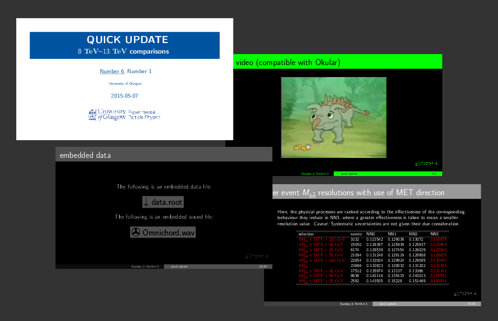

# Freyja

# introduction



Freyja can be used to create Beamer slides. It demonstrates various presentations of information, including itemised lists with checkmarks, syntax-highlighted code, static images, animated images and embedded data. It provides various configuration settings.

# features

- title page logo
- animated images (compatible with Adobe Reader)
- video (compatible with Okular)
- lists -- itemize, enumerate, description, description with checkmarks
- hyperlinks
- mathematics -- inline and equation
- code syntax highlighted
- emoticons
- blocks
- columns -- columns environment, multicols environment
- positioning by textblock
- multiple images -- tabular
- tables
- Feynman diagrams
- embedded data file, embedded sound file
- images in circle arrangement (TikZ)
- flow chart (TikZ)

# setup

```Bash
sudo apt-get -y install pdflatex
sudo apt-get -y install texlive-full
sudo apt-get -y install texlive-latex-extra
sudo apt-get -y install texlive-fonts-recommended
sudo apt-get -y install texlive-fonts-extra
sudo apt-get -y install texlive-metapost
```

# usage

The main code (including preamble etc.) is `Freyja.tex`, the configuration code of style, institution, aspect ratio etc. is `configuration.tex` and the slides code is `slides.tex`. Slides can be compiled using the script `compile.sh`.

# animated images

Animated GIFs can be converted to separate images using a procedure such as the following:

```Bash
convert -coalesce Kim_Jong-un.gif Kim_Jong-un_%d.png
```
